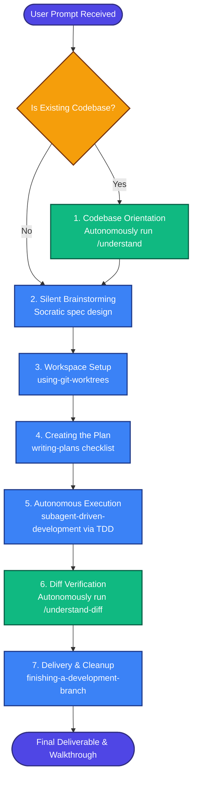

<p align="center">
  
</p>

<h1 align="center">⚡ GodMode ⚡</h1>

<p align="center">
  <strong>An advanced, zero-gate autonomous software development methodology and skills library for AI coding agents.</strong>
</p>

<p align="center">
  <a href="https://github.com/cooolbite/godmode/issues"></a>
  <a href="https://github.com/cooolbite/godmode/blob/main/LICENSE"></a>
  <a href="https://discord.gg/35wsABTejz"></a>
</p>

---

## 🚀 What is GodMode?

**GodMode** is a complete, production-grade methodology designed to turn standard AI coding agents (Claude Code, Cursor, Copilot, etc.) into disciplined, self-correcting software engineer partners. 

Instead of jumping straight into writing code, generating half-baked modifications, or avoiding test suites, GodMode agents operate on a sequential execution pipeline of highly optimized, composable skills.

---

## 🗺️ The Zero-Gate Autonomy Flow

When activated with `@godmode` or when a task is prefixed with `godmode:`, the agent executes the entire development lifecycle in a single prompt without requiring intermediate human feedback gates.



---

## ✨ Core Features

### 🧠 1. Zero-Gate Autonomy (`godmode`)
Run entire pipelines (Design ➔ Plan ➔ Workspace Setup ➔ Test-First Implementation ➔ Code Review ➔ Verification ➔ Delivery) in a single turn. Ideal for headless workflows or rapid, non-interactive execution.

### 🔌 2. Understand-Anything Token Optimization
Integrates natively with [Understand-Anything](https://github.com/Egonex-AI/Understand-Anything) to build local knowledge graphs and onboarding documents programmatically. 
*   **Context Safety:** Instead of loading multiple source files into context, the agent references structured index summaries.
*   **Token Savings:** Prevents context bloat, reducing active session token consumption by up to **80%**.

### 🤝 3. Multi-Agent Team Play (`agent-collaboration`)
Defines strict, specialized agent personas (Planner, Implementer, Verifier) with structured JSON handoff schemas, generator-verifier verification loops, and circuit breakers to prevent infinite critique loops.

---

## 🛠️ Installation & Setup

Install GodMode locally by cloning the repository and placing the skills directory inside your coding agent's configuration path.

### 1. Clone the Repository
```bash
git clone https://github.com/cooolbite/godmode.git
```

### 2. Configure for Your Agent

#### Claude Code CLI
Copy the skills directly into your local Claude Code configuration directory:
```bash
# macOS/Linux
cp -r godmode/skills/* ~/.claude/skills/

# Windows (PowerShell)
Copy-Item -Recurse godmode/skills/* $HOME/.claude/skills/
```

#### Cursor / Project-Level IDEs
Place the `skills/` folder directly into the root directory of your workspace:
```bash
cp -r godmode/skills/ path/to/your/project/skills/
```

---

## 📚 Skills Directory Catalog

### 🪐 Core & Orchestration
*   [godmode-core](skills/godmode-core/SKILL.md) — Main bootstrap skill. Establishes routing and enforces skill usage.
*   [godmode](skills/godmode/SKILL.md) — 100% autonomous, zero-interaction single-prompt task runner.
*   [agent-collaboration](skills/agent-collaboration/SKILL.md) — Multi-agent roles, structured JSON communication, and verification loops.

### 🔬 Process & Testing
*   [test-driven-development](skills/test-driven-development/SKILL.md) — Strict RED-GREEN-REFACTOR cycle execution.
*   [systematic-debugging](skills/systematic-debugging/SKILL.md) — Structured 4-phase root cause analysis.
*   [verification-before-completion](skills/verification-before-completion/SKILL.md) — Validation checklist to prove bugs are resolved.

### 🏁 Workspace & Delivery
*   [using-git-worktrees](skills/using-git-worktrees/SKILL.md) — Isolated workspace setup to work safely on separate tasks.
*   [writing-plans](skills/writing-plans/SKILL.md) — Deconstructs design specs into bite-sized 2-5 minute checklists.
*   [finishing-a-development-branch](skills/finishing-a-development-branch/SKILL.md) — Merge approval, cleanup, and walkthrough generator.

---

## 📖 Philosophy & Guardrails

*   **Test-Driven Development (TDD):** Write tests before implementation code. If code is written without a test, delete it and start over.
*   **Evidence over Claims:** Never claim a task is completed based on assumptions. Execute the verification checklist and prove it.
*   **Context Hygiene:** Leverage indexing and modular memory tools to protect the model's focus window.

---

## 🤝 Contributing

Contributions to general-purpose, cross-compatible workflows are welcome!
1. Fork this repository.
2. Checkout the `dev` branch.
3. Make your modifications, conforming to the TDD principles in [writing-skills](skills/writing-skills/SKILL.md).
4. Open a Pull Request targeting `dev`.

---

## 📄 License & Community

*   **License:** MIT License — see [LICENSE](LICENSE) for details.
*   **Discord:** Join the [community Discord](https://discord.gg/35wsABTejz) to chat with fellow agent developers.
*   **Issues & Requests:** File a report on the [GitHub Issue Tracker](https://github.com/cooolbite/godmode/issues).
