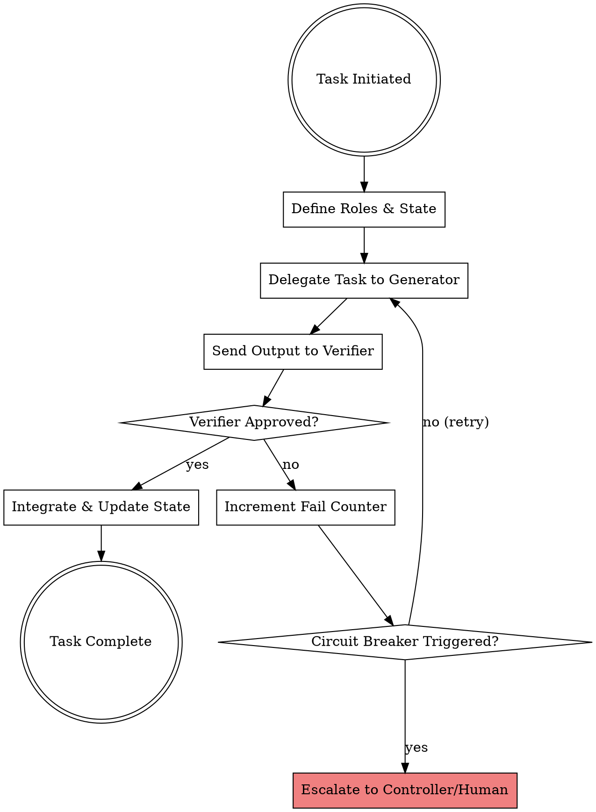

# Agent Collaboration

Establish state-of-the-art coordination protocols for multi-agent systems, ensuring reliability, context preservation, and high-quality outcomes.

## Core Principles

1. **Role Specialization:** Banish monolithic prompts. Define narrow, specific roles and tools for each agent.
2. **Generator-Verifier Duality:** Never trust a single agent to verify its own work. Pair every generator agent with a verifier.
3. **Structured Handoffs:** Use typed schemas (e.g., JSON or Pydantic format) to pass state.
4. **Fault Tolerance & Safety:** Implement loop detection (Circuit Breakers) to stop infinite agent-to-agent feedback loops.

---

## Agent Coordination Lifecycle



---

## 1. Role-Based Agent Teams (CrewAI Inspired)

Define agents with a single, clear purpose, specific tools, and bounded context.

| Role | Responsibility | Allowed Tools | Context Bounding |
| :--- | :--- | :--- | :--- |
| **Planner / Architect** | Decomposes high-level requirements into clean specifications. | Read-only tools, search, design templates | Cannot write/edit code files |
| **Implementer / Coder** | Implements code changes conforming strictly to the specification. | File edit, file write, terminal command | Bounded to target files only |
| **Verifier / Tester** | Designs and runs tests to validate correct implementation. | Test suites, terminal command, file read | Cannot edit production code |

---

## 2. Structured Handoff Protocols (LangGraph Inspired)

When passing data between agents, use structured schema validation instead of free-form text.

### The Anti-Pattern
```markdown
❌ Coder to Verifier: "I fixed the issue where the cache key was wrong. Please check it."
```

### The Pattern (Structured Handoff State)
```json
{
  "sender": "implementer",
  "receiver": "verifier",
  "payload": {
    "modified_files": ["src/cache.js"],
    "tests_run": ["npm run test:cache"],
    "verification_evidence": "All cache tests passed successfully"
  }
}
```

---

## 3. Self-Correction & Circuit Breakers (AutoGen Inspired)

To prevent infinite execution loops where two agents repeatedly critique each other:

- **Max Retry Threshold:** Limit the generator-verifier loop to **3 iterations**.
- **Self-Correction Guidelines:**
  - Verifier must provide precise, actionable error messages or failing test output.
  - Coder must read the full error, explain the root cause, and then edit the code.
- **Escalation Path:** If the threshold is exceeded, the controller agent must pause execution and request input from the human partner.

---

## Common Mistakes

| Mistake | Prevention |
| :--- | :--- |
| **Context Pollution** | Never pass the entire session history to a subagent. Build a fresh, minimal prompt. |
| **Silent Failures** | Ensure every task execution logs stdout/stderr for the verifier to inspect. |
| **Too Many Agents** | Keep the fleet simple. Do not spin up multiple agents when a single sequential pipeline suffices. |
