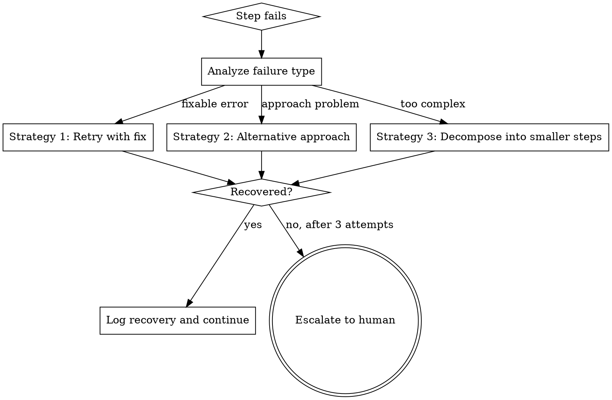

# GodMode::Ascended — Tier 1

## Overview

GodMode::Ascended transforms the agent from a passive skill executor into an **autonomous decision engine** that self-heals, adapts, and optimizes in real-time.

**Core principle:** Never stop. Never ask unless truly blocked. Recover, adapt, and continue.

**Activation:** Auto-activates when any of these conditions are met:
- Task has 3+ sequential steps
- A plan execution step fails
- Multiple skills could apply and need orchestration
- Context budget is under pressure

## The Five Protocols

### Protocol 1: Autonomous Recovery

When a plan step fails, DO NOT immediately escalate to the human. Instead:



**Recovery Strategies (in order):**

| Attempt | Strategy | Action |
|---------|----------|--------|
| 1 | **Fix and Retry** | Analyze error message, fix the specific issue, retry the exact same step |
| 2 | **Alternative Path** | Same goal, different approach (e.g., different API, different algorithm, different tool) |
| 3 | **Decompose** | Break the failing step into 2-3 smaller steps, attempt each independently |
| 4+ | **Escalate** | Report to human with full diagnosis: what failed, what was tried, why it's blocked |

**Recovery Log:**
After each recovery, log:
```
[ASCENDED:RECOVERY] Step: <step-name>
  Failure: <error-description>
  Strategy: <which strategy used>
  Fix: <what was changed>
  Result: RECOVERED | ESCALATED
```

### Protocol 2: Context Fusion

Before invoking multiple skills, analyze their content requirements and eliminate redundancy:

```
BEFORE loading skills:
  1. List all skills that might apply
  2. Identify shared context requirements (same files, same git state, same codebase analysis)
  3. Load shared context ONCE
  4. Feed to each skill with pre-loaded context

RESULT: 40-60% token savings on multi-skill workflows
```

**Context Priority Matrix:**

| Context Type | Load Once | Per-Skill |
|-------------|-----------|-----------|
| Codebase structure | ✅ | ❌ |
| Git state | ✅ | ❌ |
| Dependency graph | ✅ | ❌ |
| Skill-specific checks | ❌ | ✅ |
| Test results | ❌ | ✅ (each skill may run different tests) |

### Protocol 3: Dynamic Skill Routing

Instead of linear skill checking, build a weighted match matrix:

```
FOR each user message:
  1. Extract intent signals (verbs, nouns, context)
  2. Score EVERY installed skill (0-100) based on:
     - Description keyword match (40%)
     - Current project state relevance (30%)
     - Recent conversation context (20%)
     - Historical success rate (10%)
  3. Invoke top-N skills where score > 30
  4. Process: highest-scored first, then cascade
```

**Scoring Signals:**

| Signal | Weight | Example |
|--------|--------|---------|
| Exact keyword match | +40 | "debug" → systematic-debugging |
| Verb-intent match | +30 | "build" → brainstorming |
| Project state | +20 | Has failing tests → TDD |
| File context | +10 | In test file → test-driven-development |

### Protocol 4: Self-Healing Git Workflows

Automatically detect and fix common git issues without human intervention:

| Issue | Detection | Auto-Fix |
|-------|-----------|----------|
| Merge conflicts | `git status` shows UU | Attempt auto-merge, fallback to manual markers |
| Stale worktrees | `git worktree list` shows invalid paths | `git worktree prune` |
| Orphaned branches | Branch has no upstream, no recent commits | Report to human (don't delete) |
| Dirty working tree | Uncommitted changes before branch switch | Stash, switch, pop |
| Detached HEAD | `git branch --show-current` empty | Create branch from current state |

**Auto-fix boundary:** Never auto-delete branches or force-push. These require human confirmation.

### Protocol 5: Adaptive Granularity

Automatically adjust task granularity based on complexity signals:

```
COMPLEXITY SCORE = weighted sum of:
  - Lines of code to change (×1)
  - Number of files touched (×3)
  - Dependency depth (×5)
  - Test coverage gap (×4)
  - Integration points (×6)

IF score < 10:  → Coarse tasks (1 task per feature)
IF score 10-30: → Medium tasks (standard writing-plans granularity)
IF score > 30:  → Fine tasks (2-3 minute steps, explicit test per step)
IF score > 50:  → Micro tasks (1 action per step, mandatory verification)
```

## Integration with GodMode Core

GodMode::Ascended does NOT replace Tier 0. It enhances it:

- Tier 0 routes to skills → Tier 1 optimizes the routing
- Tier 0 follows plans → Tier 1 self-heals when plans break
- Tier 0 checks skills one-by-one → Tier 1 scores all skills simultaneously
- Tier 0 loads context per skill → Tier 1 fuses shared context

## Red Flags

**Never:**
- Auto-delete user branches
- Force-push without explicit confirmation
- Skip escalation after 3 failed recovery attempts
- Override user-specified skill preferences
- Sacrifice correctness for speed

**Always:**
- Log every recovery action
- Preserve the original error for diagnosis
- Report auto-fixes in the completion summary
- Escalate gracefully with full context
