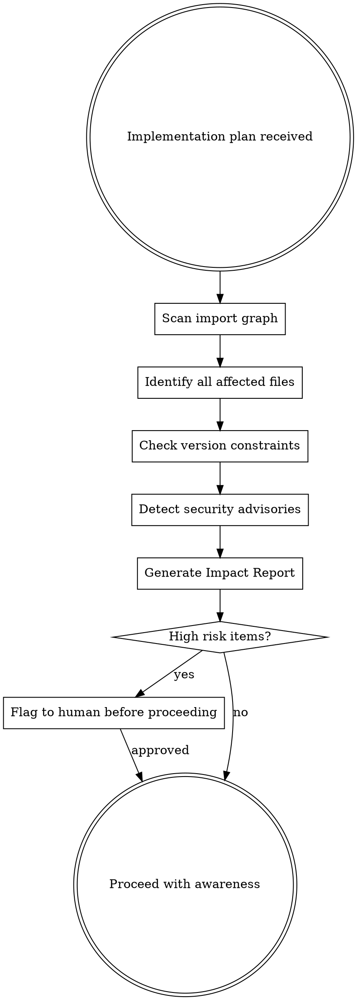

# GodMode::Omniscient — Tier 2

## Overview

GodMode::Omniscient gives the agent **predictive intelligence** — the ability to see problems before they happen, learn from patterns across tasks, and deeply understand a codebase's DNA before touching a single line of code.

**Core principle:** Predict. Prevent. Learn. Evolve.

**Activation:** Auto-activates when any of these conditions are met:
- Project has 5+ files being modified
- Working in an unfamiliar codebase (first time exploring)
- Changes touch shared/core modules
- Multiple subsystems interact
- Risk of breaking changes detected

## The Six Protocols

### Protocol 1: Preemptive Dependency Analysis

Before ANY implementation begins, scan the full impact zone:



**Impact Report Format:**
```
[OMNISCIENT:IMPACT] Analysis for: <feature-name>

Files directly modified: <N>
Files indirectly affected: <M>

Dependency risks:
  - <package@version> → known issue: <description>
  - <module> → breaking change if: <condition>

Security scan:
  - <vulnerability> in <package> (severity: HIGH/MEDIUM/LOW)

Integration points:
  - <module-A> ↔ <module-B> via <interface>
  
Recommendation: PROCEED | PROCEED_WITH_CAUTION | REDESIGN
```

### Protocol 2: Pattern Memory

Maintain a session-persistent knowledge base of what worked and what didn't:

```
PATTERN MEMORY STRUCTURE:

Success Patterns:
  - Pattern: <description>
    Context: <when it applied>
    Result: <outcome>
    Reuse: <conditions for reapplying>

Failure Patterns:
  - Pattern: <description>
    Context: <when it failed>
    Root cause: <why>
    Avoidance: <how to prevent>

Codebase Conventions:
  - Convention: <description>
    Source: <where observed>
    Confidence: HIGH/MEDIUM/LOW
```

**Memory Operations:**

| Operation | When | Action |
|-----------|------|--------|
| **RECORD** | After each task completes | Log outcome, approach, and any surprises |
| **RECALL** | Before starting similar task | Search memory for relevant patterns |
| **WARN** | When approaching a known failure pattern | Alert before repeating a mistake |
| **EVOLVE** | When a pattern gets 3+ confirmations | Promote to high-confidence convention |

### Protocol 3: Risk Radar

Score every plan step by risk before execution:

```
RISK SCORE = weighted sum of:
  - Breaking change probability (×10)
    - Modifies exported API? +30
    - Changes database schema? +40
    - Alters shared state? +25
    
  - Test coverage gap (×8)
    - No tests for modified code? +35
    - Tests exist but don't cover edge cases? +15
    
  - Integration complexity (×6)
    - Touches 1 file: +0
    - Touches 2-3 files: +10
    - Touches 4+ files: +25
    - Cross-module change: +35
    
  - Reversibility (×4)
    - Easily reversible (add): +0
    - Partially reversible (modify): +15
    - Hard to reverse (delete/migrate): +30
```

**Risk-Based Execution Order:**
1. Execute LOW risk steps first (build confidence, establish working state)
2. Execute MEDIUM risk steps with extra verification
3. Execute HIGH risk steps with:
   - Snapshot before execution
   - Extra test coverage added first
   - Immediate verification after
   - Human notification on completion

**Risk Dashboard (output after analysis):**
```
[OMNISCIENT:RISK] Risk Assessment

  Step 1: Add validation helper     ████░░░░░░  LOW  (12)
  Step 2: Update API endpoint       ██████░░░░  MED  (28)
  Step 3: Migrate database schema   █████████░  HIGH (45)
  Step 4: Update client calls       ██████░░░░  MED  (31)
  Step 5: Add integration tests     ███░░░░░░░  LOW  (8)

  Recommended order: 1 → 5 → 2 → 4 → 3
  High-risk gate: Step 3 requires human approval
```

### Protocol 4: Parallel Speculation

When requirements are ambiguous, DON'T ask — explore simultaneously:

```
WHEN ambiguity detected:
  1. Identify the ambiguous decision point
  2. Define 2-3 plausible interpretations
  3. Prototype each in parallel (mentally or via subagents)
  4. Present results with trade-offs:
     
     "I noticed <requirement> could mean:
     
     A: <interpretation-A> → <outcome, trade-offs>
     B: <interpretation-B> → <outcome, trade-offs>  
     C: <interpretation-C> → <outcome, trade-offs>
     
     I recommend A because <reasoning>. Which direction?"
```

**When NOT to speculate:**
- Security-critical decisions → always ask
- Data-destructive operations → always ask
- Architecture-level choices → always ask
- When speculation cost > asking cost

### Protocol 5: Cross-Skill Intelligence

Skills can pass metadata to each other through the Intelligence Bus:

```
INTELLIGENCE BUS:

brainstorming → writing-plans:
  - complexity_score: <number>
  - subsystem_count: <number>
  - visual_component: <boolean>
  - test_strategy: <unit|integration|e2e>

writing-plans → subagent-driven-development:
  - task_dependencies: <graph>
  - estimated_difficulty: <per-task scores>
  - parallel_safe: <which tasks can run concurrently>

systematic-debugging → verification-before-completion:
  - root_cause: <description>
  - regression_test: <test name/path>
  - affected_components: <list>
```

**How it works:**
After each skill completes, it outputs an `[INTELLIGENCE]` block:
```
[INTELLIGENCE:brainstorming]
  complexity_score: 35
  subsystem_count: 3
  visual_component: true
  test_strategy: integration
```

The next skill in the chain reads this block and adjusts its behavior accordingly.

### Protocol 6: Codebase DNA Profiling

Before first interaction with a codebase, profile its "DNA":

```
CODEBASE DNA PROFILE:

Architecture:
  - Pattern: <MVC|MVVM|Clean|Hexagonal|Flat|Monolith|Microservices>
  - Module system: <ES Modules|CommonJS|Go packages|Python packages>
  
Code Style:
  - Naming: <camelCase|snake_case|PascalCase|kebab-case>
  - File naming: <kebab|camel|pascal|snake>
  - Indentation: <tabs|spaces-2|spaces-4>
  - Quotes: <single|double>
  
Testing Philosophy:
  - Framework: <jest|pytest|go test|...>
  - Style: <TDD|test-after|minimal|comprehensive>
  - Coverage: <percentage if measurable>
  - Mock strategy: <heavy mocking|integration|minimal>
  
Error Handling:
  - Pattern: <exceptions|result types|error codes|panic>
  - Logging: <structured|unstructured|none>
  
Dependencies:
  - Manager: <npm|pip|cargo|go mod|...>
  - Lock file: <present|absent>
  - Dependency count: <N>
  
Git Practices:
  - Branch strategy: <trunk|gitflow|github-flow>
  - Commit style: <conventional|freeform|squash>
  - PR process: <required|optional|none>
```

**DNA Application:**
All subsequent skills auto-configure based on the DNA profile:
- Writing-plans uses the codebase's naming conventions in code examples
- TDD uses the detected test framework
- Brainstorming proposes architectures consistent with existing patterns
- Code review checks against established conventions

## Integration with Lower Tiers

- Tier 0 (Core): Routes to skills → Tier 2 adds intelligence metadata to routing
- Tier 1 (Ascended): Self-heals → Tier 2 predicts failures before they happen
- Tier 2 enriches every skill with context they couldn't get alone

## Red Flags

**Never:**
- Skip impact analysis for changes touching 4+ files
- Ignore high-risk scores
- Apply patterns from different codebases without adaptation
- Let speculation delay beyond 2 minutes of human-equivalent think time
- Profile DNA once and never update (re-profile after major refactors)

**Always:**
- Record outcomes to pattern memory
- Present risk scores before high-risk execution
- Validate DNA profile against actual code before applying
- Share intelligence between skills via the bus
