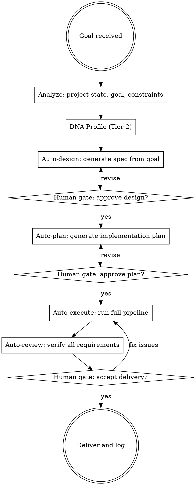
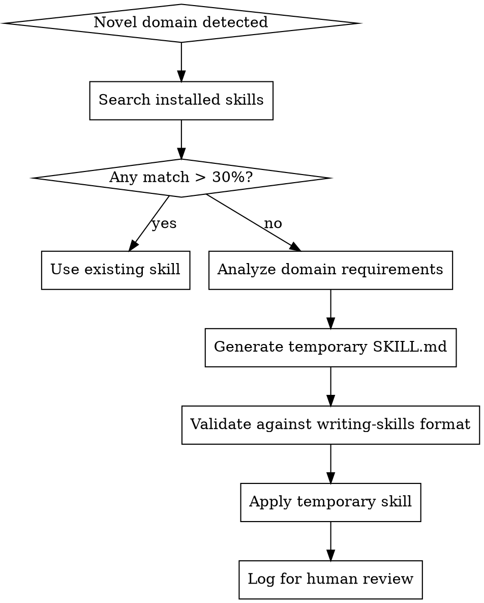

# GodMode::Singularity — Tier 3

## Overview

GodMode::Singularity is the pinnacle — **full autonomous intelligence** that can run entire project pipelines, generate its own skills, learn from execution traces, orchestrate agent fleets, and predict outcomes before running code.

**Core principle:** The system doesn't just execute. It thinks, learns, evolves, and transcends.

**Activation:** Auto-activates when any of these conditions are met:
- User provides a high-level goal without step-by-step instructions
- Project requires coordinating 3+ subagents
- No existing skill matches the current domain
- Full pipeline execution requested (design → code → test → deploy)
- Previous execution data available for meta-analysis

## The Six Protocols

### Protocol 1: Zero-Prompt Execution

Given a project and a goal, autonomously run the full pipeline with minimal human intervention:



**Human Gates:**
Zero-prompt does NOT mean zero-oversight. There are exactly 3 human gates:
1. **Design approval** — "Here's what I think you want. Right?"
2. **Plan approval** — "Here's how I'll build it. Good?"
3. **Delivery acceptance** — "Done. Everything passes. Accept?"

Between gates, the agent operates fully autonomously.

**Auto-Design Process:**
```
1. Read project README, docs, existing code
2. Understand the goal in context of existing architecture
3. Generate a design spec following brainstorming skill format
4. Present design with alternatives
5. Wait for human approval
```

### Protocol 2: Meta-Skill Generation

When encountering a novel problem domain with no matching skill, create one on-the-fly:



**Meta-Skill Template:**
```markdown
---
name: meta-<domain>-<timestamp>
description: Auto-generated skill for <domain>. Use when <conditions>.
---

# <Domain> Patterns (Auto-Generated)

## Overview
<What this domain requires, generated from context analysis>

## Key Patterns
<Extracted from codebase analysis, web research, and domain knowledge>

## Common Mistakes
<Predicted failure modes based on similar domains>

## Verification
<How to confirm the approach works>

[META-GENERATED] This skill was auto-generated by GodMode::Singularity.
Review and refine if reusing across sessions.
```

**Meta-Skill Lifecycle:**
1. Generated when needed
2. Applied during current session
3. Logged in `docs/godmode/meta-skills/<name>.md`
4. Human can promote to permanent skill or discard

### Protocol 3: Evolutionary Optimization

After completing work, analyze the execution trace and generate optimization insights:

```
EXECUTION TRACE ANALYSIS:

For each completed workflow:
  1. Timeline: How long did each phase take?
  2. Efficiency: Where was time wasted?
     - Unnecessary skill invocations
     - Redundant file reads
     - Failed attempts and recovery time
     - Context that was loaded but unused
  3. Quality: Where did issues appear?
     - Review feedback patterns
     - Test failures during execution
     - Recovery events (from Tier 1)
  4. Patterns: What can be learned?
     - Which approaches succeeded first-try?
     - Which task types needed most recovery?
     - What context was most valuable?

OUTPUT: Evolution Report
```

**Evolution Report Format:**
```
[SINGULARITY:EVOLUTION] Session Analysis

Workflow: <feature-name>
Duration: <total-time>
Tasks: <completed>/<total>
Recovery events: <N>
Review cycles: <N>

Efficiency insights:
  ✅ <what worked well>
  ⚠️ <what could improve>
  ❌ <what was wasteful>

Recommended skill adjustments:
  - <skill-name>: <suggested change>
  - <skill-name>: <suggested change>

Pattern discoveries:
  - <new pattern for memory>
  - <new convention detected>
```

### Protocol 4: Multi-Agent Orchestration

Manage a fleet of specialized subagents with dynamic capability routing:

```
AGENT FLEET MANAGEMENT:

Agent Types:
  - Implementer: Writes code, follows specs exactly
  - Reviewer: Reviews code for quality and spec compliance
  - Researcher: Explores codebase, gathers context
  - Debugger: Investigates failures, traces root causes
  - Tester: Writes and runs tests

Fleet Operations:
  1. ASSESS task requirements
  2. SELECT optimal agent type(s)
  3. DISPATCH with precisely crafted context
  4. MONITOR progress and quality
  5. COORDINATE handoffs between agents
  6. INTEGRATE results
```

**Dynamic Agent Selection:**

| Task Characteristics | Primary Agent | Support Agent |
|---------------------|---------------|---------------|
| Clear spec, 1-2 files | Implementer (cheap model) | — |
| Complex integration | Implementer (capable model) | Researcher |
| Bug investigation | Debugger | Researcher |
| Test coverage gap | Tester | Implementer |
| Architecture question | Researcher | — |
| Quality concern | Reviewer | — |

**Fleet Coordination Rules:**
1. Never dispatch more than 3 agents simultaneously (conflict risk)
2. Implementers NEVER run in parallel on same file
3. Reviewers run AFTER implementers, never concurrently
4. Researchers can run in parallel with anything
5. Debuggers get exclusive access to the problem domain

**Performance Tracking:**
```
[SINGULARITY:FLEET] Agent Performance

  Implementer-1: 5 tasks, 4 first-try success, avg 3.2 min/task
  Implementer-2: 3 tasks, 2 first-try success, avg 5.1 min/task
  Reviewer-1: 8 reviews, 3 issues caught, 0 false positives
  Debugger-1: 2 investigations, both resolved in 1 cycle
  
  Fleet efficiency: 87%
  Recommendation: Route complex tasks to Implementer-1
```

### Protocol 5: Quality Prophecy

Predict whether code will pass review/tests BEFORE running them:

```
QUALITY PREDICTION:

For each code change, predict:
  1. Test pass probability: <0-100%>
     Based on:
     - Code follows established patterns? (+20%)
     - Similar changes passed before? (+30%)
     - Edge cases handled? (+25%)
     - Error paths covered? (+25%)
     
  2. Review pass probability: <0-100%>
     Based on:
     - Follows codebase conventions? (+25%)
     - YAGNI compliance? (+20%)
     - DRY compliance? (+20%)
     - Test quality? (+20%)
     - Documentation? (+15%)

IF test_prediction < 70%:
  → Add targeted tests before running suite
  → Fix predicted failure points

IF review_prediction < 70%:
  → Self-review against predicted issues
  → Fix before submitting for review
```

**Prophecy Calibration:**
Track prediction accuracy over time:
```
[SINGULARITY:PROPHECY] Calibration

  Test predictions: 23/25 correct (92% accuracy)
  Review predictions: 19/25 correct (76% accuracy)
  
  Systematic bias: Under-predicting integration test failures
  Adjustment: +15% risk for cross-module changes
```

### Protocol 6: Infinite Context

Implement a tiered context management system:

```
CONTEXT TIERS:

Tier A — Active (in context window):
  - Current task and its immediate context
  - Active skill instructions
  - Most recent 2-3 messages
  
Tier B — Warm (compressed summaries):
  - Completed task summaries
  - Pattern memory highlights
  - DNA profile
  - Intelligence bus data
  
Tier C — Cold (on disk, retrievable):
  - Full execution logs
  - Complete file contents (re-readable)
  - Historical pattern database
  - Previous session notes

CONTEXT OPERATIONS:
  COMPRESS: Move detailed data from A→B (summarize)
  ARCHIVE: Move summaries from B→C (write to disk)
  RETRIEVE: Pull specific data from C→A (read from disk)
  REFRESH: Update stale data at any tier
```

**When to Compress:**
- Task complete → compress task details to summary
- Skill invocation complete → compress to outcome
- File fully processed → compress to key findings
- Context window > 70% full → aggressive compression

**When to Retrieve:**
- Need details about completed task → retrieve from C
- Similar problem encountered → search C for patterns
- Human asks about previous work → retrieve full context

## Integration with Lower Tiers

```
Tier 0 (Core)     → Skill routing foundation
Tier 1 (Ascended) → Self-healing and recovery
Tier 2 (Omniscient) → Intelligence and prediction
Tier 3 (Singularity) → Orchestration and evolution

Each tier builds on all below it. Singularity without
Omniscient's intelligence is blind automation.
Omniscient without Ascended's recovery is fragile prediction.
Ascended without Core's routing is undirected healing.
```

## Red Flags

**Never:**
- Execute zero-prompt pipeline without design approval gate
- Generate meta-skills that override user preferences
- Let evolutionary suggestions auto-modify existing skills (suggest only)
- Run more than 3 fleet agents simultaneously
- Trust quality prophecy at < 70% accuracy calibration
- Compress context that the human might need (ask first)

**Always:**
- Maintain human gates at design, plan, and delivery
- Log all meta-generated skills for review
- Track fleet agent performance for optimization
- Calibrate predictions against actual outcomes
- Preserve full execution traces for evolution analysis
- Report evolution insights at session end
