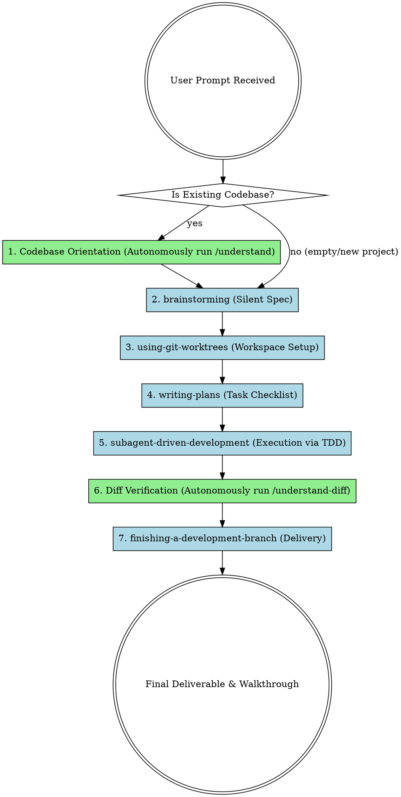

# GodMode (Zero-Gate Autonomy Flow)

Operate with 100% autonomy to design, plan, implement, test, and deliver a task in a single turn without intermediate human verification gates, chaining all GodMode core skills in sequence.

## The Autonomous Sequential Flow

---

## 1. Autonomous Codebase Orientation
- **Action:** Check if the project is a brand new/empty workspace (no files besides standard config files). 
- If **empty/new**, skip this step entirely and proceed to **Silent Brainstorming**.
- If **existing codebase**, autonomously execute `/understand` (or `npx understand-anything`) in the terminal to build or update the local knowledge graph, then read the summaries (`ONBOARDING.md`) to conserve tokens.

## 2. Silent Brainstorming
- **Skill:** Use `godmode:brainstorming`
- Refine the design internally. Explore architectural options and make safe assumptions without prompting the user.

## 3. Workspace Setup
- **Skill:** Use `godmode:using-git-worktrees`
- Set up an isolated git branch or directory structure to perform the work safely.

## 4. Creating the Plan
- **Skill:** Use `godmode:writing-plans`
- Create a detailed implementation plan. Break down the work into independent, testable tasks of 2-5 minutes each.

## 5. Autonomous Execution
- **Skills:** Use `godmode:subagent-driven-development` (or `godmode:executing-plans` / `godmode:dispatching-parallel-agents`)
- Spin up subagents (or iterate internally) to execute the plan tasks sequentially following the Test-Driven Development (TDD) cycle.

## 6. Autonomous Diff Verification
- **Action:** Autonomously execute `/understand-diff` (if an existing codebase and changes are made) to analyze impact.
- Use `godmode:requesting-code-review` and `godmode:receiving-code-review` to fix any issues.

## 7. Delivery & Branch Cleanup
- **Skill:** Use `godmode:finishing-a-development-branch`
- Merge the changes locally, cleanup the temporary worktree, and present a complete walkthrough and status update to the user.
