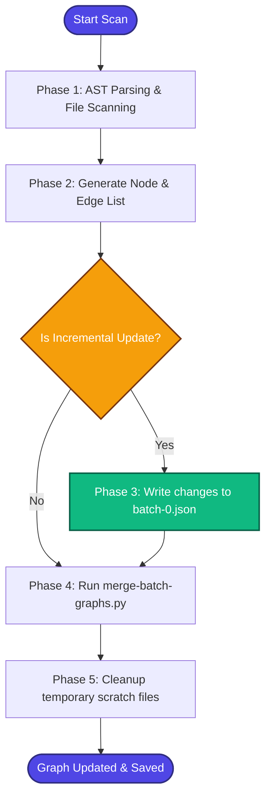

# Codebase Orientation (Understand-Anything)

Analyze codebases, build interactive knowledge graphs, and perform token-efficient, incremental updates using Egonex-AI's `Understand-Anything` tool suite.

## Core Commands

| Command | Action |
| :--- | :--- |
| `/understand` | Runs full codebase scan and AST parser to build local knowledge graph. |
| `/understand-dashboard` | Opens interactive web UI dashboard to explore the dependency graph. |
| `/understand-chat <query>` | Asks specific structural or semantic questions about code design. |
| `/understand-diff` | Performs impact analysis on uncommitted local git changes. |

---

## 🔄 Analysis & Merge Phases

When executing or updating the knowledge graph, follow these sequential phases:

### Phase 1: AST Parsing
- The tool scans all files in the workspace (excluding `.gitignore` patterns).
- Resolves import/export relationships, function calls, class hierarchies, and type dependencies.

### Phase 2: Node & Edge List Generation
- Generates JSON node descriptors for all classes, functions, and modules.
- Generates edge descriptors representing structural calls or imports.

### Phase 3: Incremental Update (Bugfix Protocol)
> [!IMPORTANT]
> When updating an existing graph, the tool merges new nodes with the base graph.
> *   **Do NOT** write changes to `batch-existing.json`. The merge script (`merge-batch-graphs.py`) uses a regular expression that only processes files containing digits (e.g., `batch-<N>.json`).
> *   **Correct action:** Always write updated/pruned nodes to a numerically indexed file, such as `batch-0.json` (or `batch-1.json`, etc.), so that the merge script correctly picks it up.

### Phase 4: Merging
- Combines the newly scanned changes with the existing graph metadata.
- Prunes orphaned nodes (e.g., deleted or renamed files) to maintain graph hygiene.

### Phase 5: Cleanup
- Safely remove temporary build folders and intermediate JSON chunks.
- Save the final output to `.understand-anything/knowledge-graph.json` and generate `ONBOARDING.md` in the project root.
